# Assignment 1 Report

Course: Big Data - IU  
Assignment: Big Data Storage in SQL vs. NoSQL Databases  
Student: Aleksandr Gavkovskii 

SID: 50  

Note: A subset of screenshots in this report is not full-screen due to a late realization of the screenshot formatting requirement.

---

## I. Data Preparation [5 points]

### I.1 User Slice Extraction

I extracted my user slice from `users.txt` using the provided script `select_my_user_slice.py` without modifying its logic.  
The script was executed with my assigned SID and generated `my_users.csv`.

Command used:

```bash
python select_my_user_slice.py
```

Output file:
- `my_users.csv`

**Screenshot placeholders (full screen):**
- `[SS-I1-1]` Terminal command + script output for user slice extraction.
  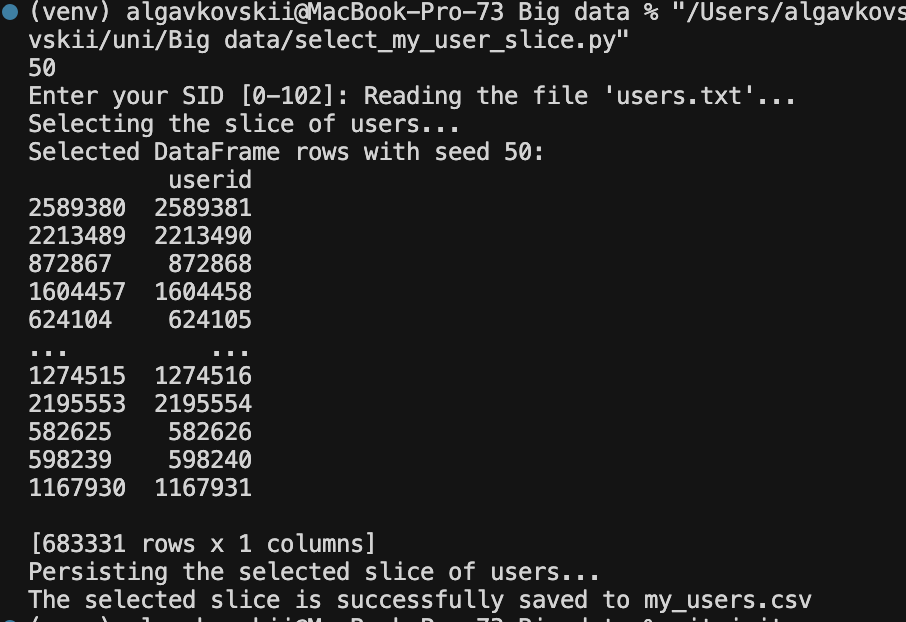
- `[SS-I1-2]` File preview showing `my_users.csv`.
  

---

### I.2 Preparing Check-ins, Friendships, and POIs for My Slice

To avoid loading the full dataset in memory, I used a streaming script `prepare_my_custom_files.py` that:
- loads user IDs from `my_users.csv`,
- filters check-ins belonging only to my users,
- filters friendship edges where both `userid` and `friendid` are in my slice,
- extracts only POIs referenced by my users' check-ins.

Command used:

```bash
python prepare_my_custom_files.py
```

Generated files:
- `my_checkins_anonymized.tsv`
- `my_frienship_before.tsv`
- `my_frienship_after.tsv`
- `my_POIs.tsv`

Result summary:

| File | Rows |
|---|---:|
| `my_users.csv` | 683,331 |
| `my_checkins_anonymized.tsv` | 22,662,428 |
| `my_frienship_before.tsv` | 22,237 |
| `my_frienship_after.tsv` | 37,475 |
| `my_POIs.tsv` | 4,588,899 |

**Screenshot placeholders (full screen):**
- `[SS-I2-1]` Code of `prepare_my_custom_files.py`.
  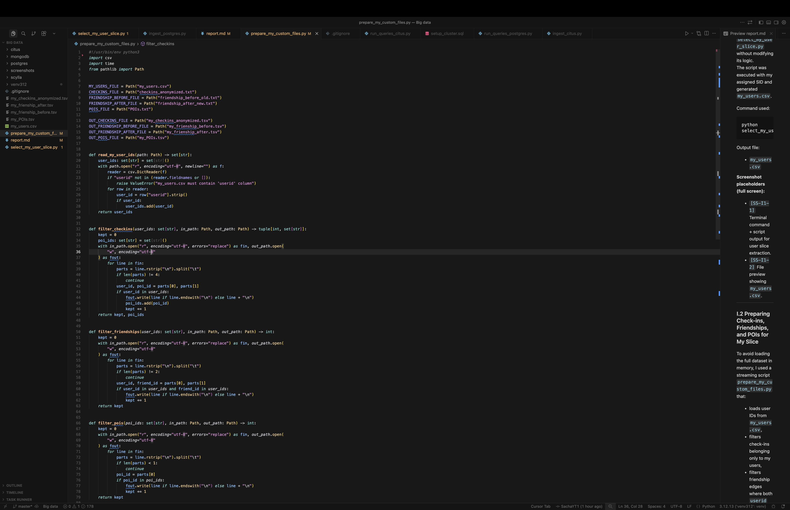
- `[SS-I2-2]` Terminal output of `prepare_my_custom_files.py`.
  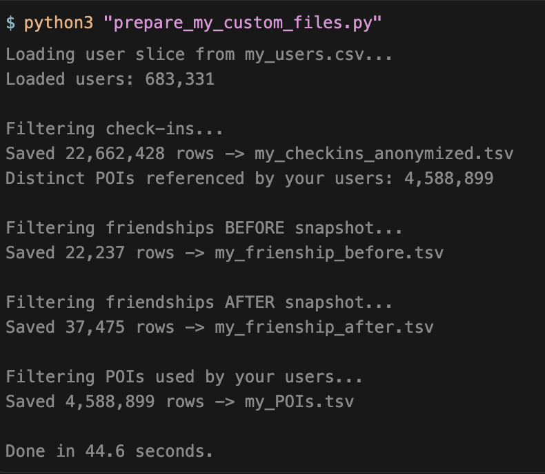
- `[SS-I2-3]` Command/output showing row counts of generated files.
  

---

### I.3 Cleanup of Non-Personal Source Files

After generating my custom files, I removed source files that do not belong to my final slice deliverables (as requested by assignment instructions), keeping only the `my_*` files required for ingestion and analysis.

**Screenshot placeholder (full screen):**
- `[SS-I3-1]` File explorer/terminal view after cleanup.
  

---

## II. Data Modeling & Ingestion [PostgreSQL only]

## II.A PostgreSQL (Standalone) Schema Design [17 points, PostgreSQL part]

### II.A.1 Database and Schema Instructions

Database name: `foursquaredb`

Schema SQL file:
- `postgres/schema_postgres.sql`

Main objects created:
- `users(userid)`
- `pois(poi_id, latitude, longitude, category, country)`
- `checkins(checkin_id, userid, poi_id, checkin_time_text, tz_offset_minutes)`
- `friendship_before(userid, friendid)`
- `friendship_after(userid, friendid)`

Constraints:
- Primary keys on all entity tables
- Foreign keys from `checkins` and friendship tables to `users`/`pois`

Indexes used:
- `idx_checkins_userid`
- `idx_checkins_poi_id`
- `idx_checkins_userid_poi_id`
- `idx_pois_country`
- `idx_friendship_before_friendid`
- `idx_friendship_after_friendid`
- `idx_pois_category_tsv` (GIN FTS index)

Example creation flow:

```sql
CREATE DATABASE foursquaredb;
\c foursquaredb;
-- run postgres/schema_postgres.sql
```

Design rationale (brief):
The schema keeps stable entity separation (`users`, `pois`) and fact-like events in `checkins`, with social snapshots in two dedicated friendship tables. This model is normalized enough to reduce duplication while still supporting analytical joins efficiently through targeted indexes.

**Screenshot placeholders (full screen):**
- `[SS-IIA-1]` `schema_postgres.sql` visible in editor.
  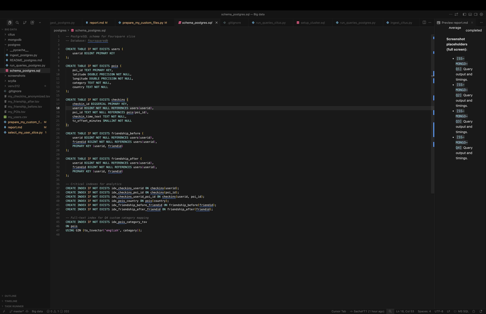
- `[SS-IIA-2]` pgAdmin tree showing created tables in `foursquaredb`.
  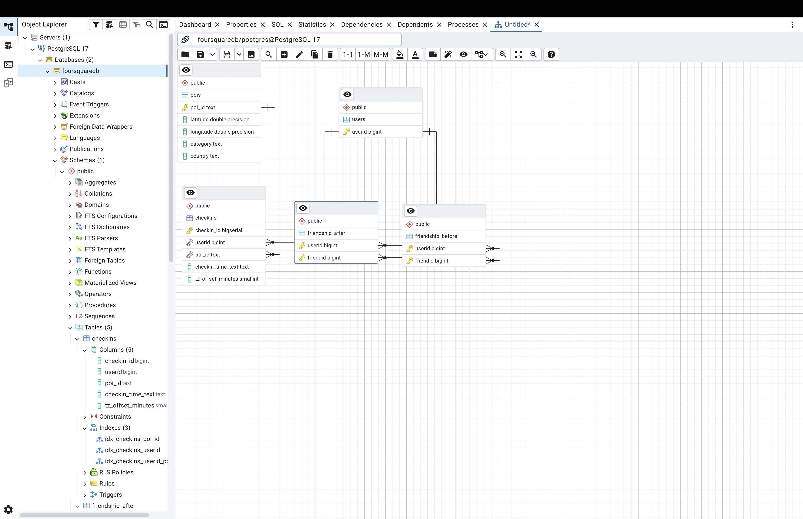
- `[SS-IIA-3]` pgAdmin/SQL output showing indexes and constraints.
  

---

## II.B Data Ingestion [14 points, PostgreSQL row]

Ingestion script:
- `postgres/ingest_postgres.py`

Script responsibilities:
1. Connect to PostgreSQL (`foursquaredb`)
2. Recreate schema
3. Bulk load all prepared files using `COPY`
4. Report ingestion time per table and total ingestion time

Command used:

```bash
python postgres/ingest_postgres.py --dbname foursquaredb --skip-create-db
```

Database setup (for final table):
- Standalone PostgreSQL single server

Observed PostgreSQL ingestion output:

| Table | Time (sec) |
|---|---:|
| `users` | 1.07 |
| `pois` | 32.53 |
| `checkins` | 3849.46 |
| `friendship_before` | 0.14 |
| `friendship_after` | 0.23 |
| **TOTAL** | **3883.44** |

Ingestion metrics table:

| Database | Total Ingestion time | Database Setup | CPU cores allocated | Main Memory usage |
|---|---:|---|---:|---:|
| PostgreSQL | `3883.44 sec` | A single server | `12` | `36 GiB` |
| Citus Data | `188.58 sec` | A cluster of `3` nodes | `12` | `36 GiB` |
| ScyllaDB | `3310.36 sec` | A cluster of `3` nodes | `3 (1 per node)` | `6 GiB (2 GiB per node)` |
| MongoDB | `Not completed` | A replica set of `3` nodes | `Not measured` | `Not measured` |

**Screenshot placeholders (full screen):**
- `[SS-IIB-1]` `ingest_postgres.py` code.
  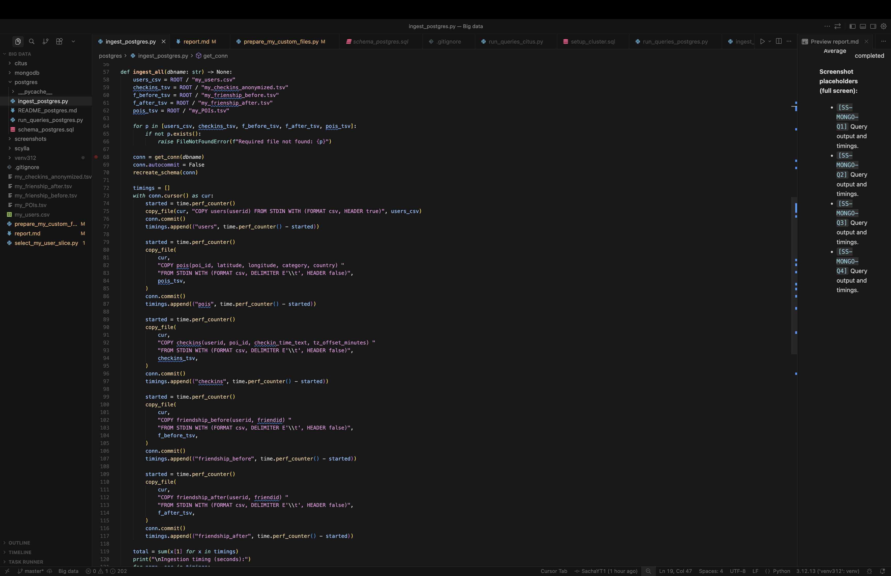
- `[SS-IIB-2]` Terminal output with per-table and total ingestion time.
  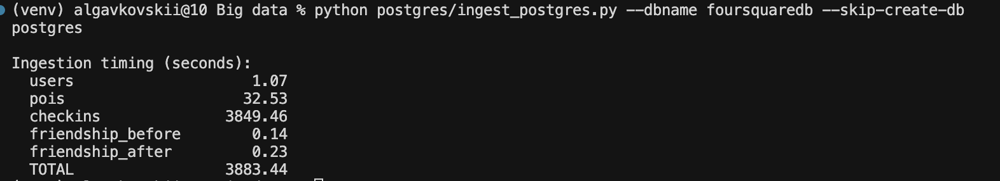

---

## III. Analytical Query Execution [PostgreSQL only]

Benchmark method:
- Script: `postgres/run_queries_postgres.py`
- Each query executed **3 times**
- Reported metric: **average execution time**

Command used:

```bash
python postgres/run_queries_postgres.py --dbname foursquaredb --runs 3 --q4-category Club
```

---

### Q1. Top 10 countries with the highest total number of check-ins

Justification (2-3 sentences):  
This query joins `checkins` with `pois` through `poi_id` to map each check-in to a country. It then aggregates counts by country and sorts descending to find the top 10 most active countries in my user slice. This directly measures geographic check-in concentration.

Query text:

```sql
SELECT p.country, COUNT(*) AS total_checkins
FROM checkins c
JOIN pois p ON p.poi_id = c.poi_id
GROUP BY p.country
ORDER BY total_checkins DESC
LIMIT 10;
```

Result + timing:

| Run | Time (sec) |
|---:|---:|
| 1 | 2.7477 |
| 2 | 2.3761 |
| 3 | 2.3738 |
| Average | 2.4992 |

Sample result (top countries):
- `TR` - 4,398,635
- `US` - 3,228,003
- `BR` - 2,508,051

**Screenshot placeholders (full screen):**
- `[SS-Q1-1]` Query code and output rows.
  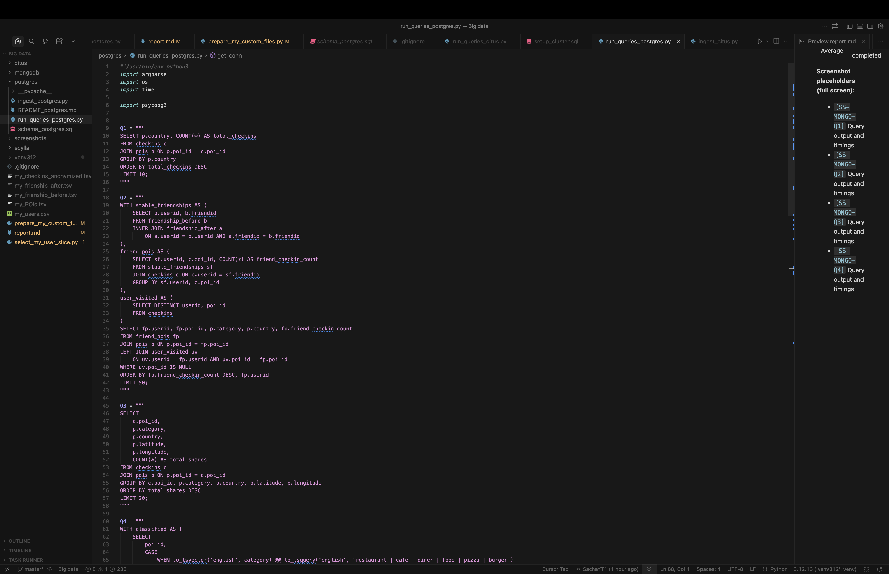
- `[SS-Q1-2]` Terminal timing output (3 runs + average).
  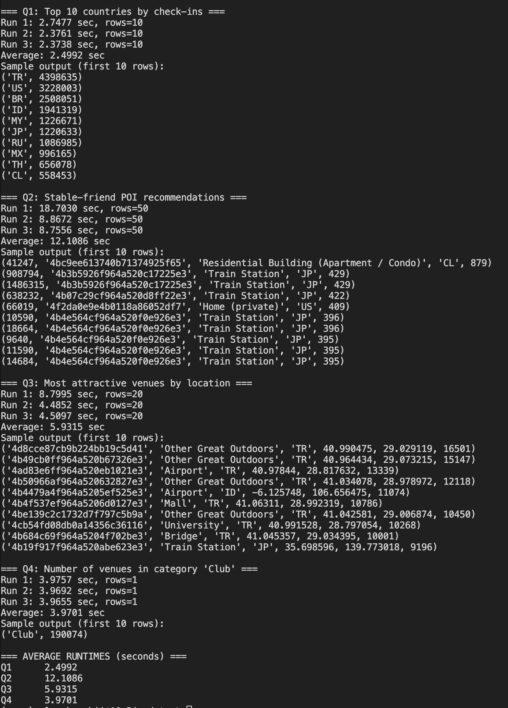

---

### Q2. POIs preferred by users' stable friends

Justification (2-3 sentences):  
The query first computes stable friendships (edges that appear in both snapshots), then aggregates POIs visited by friends. It excludes POIs already visited by the target user, producing candidate POIs that may be socially relevant for recommendation-like display on the home page. This follows the task requirement to consider unchanged friendships only.

Query text:

```sql
WITH stable_friendships AS (
    SELECT b.userid, b.friendid
    FROM friendship_before b
    INNER JOIN friendship_after a
        ON a.userid = b.userid AND a.friendid = b.friendid
),
friend_pois AS (
    SELECT sf.userid, c.poi_id, COUNT(*) AS friend_checkin_count
    FROM stable_friendships sf
    JOIN checkins c ON c.userid = sf.friendid
    GROUP BY sf.userid, c.poi_id
),
user_visited AS (
    SELECT DISTINCT userid, poi_id
    FROM checkins
)
SELECT fp.userid, fp.poi_id, p.category, p.country, fp.friend_checkin_count
FROM friend_pois fp
JOIN pois p ON p.poi_id = fp.poi_id
LEFT JOIN user_visited uv
    ON uv.userid = fp.userid AND uv.poi_id = fp.poi_id
WHERE uv.poi_id IS NULL
ORDER BY fp.friend_checkin_count DESC, fp.userid
LIMIT 50;
```

Result + timing:

| Run | Time (sec) |
|---:|---:|
| 1 | 18.7030 |
| 2 | 8.8672 |
| 3 | 8.7556 |
| Average | 12.1086 |

Sample result (first rows):
- `(41247, 4bc9ee613740b71374925f65, Residential Building (Apartment / Condo), CL, 879)`
- `(908794, 4b3b5926f964a520c17225e3, Train Station, JP, 429)`

**Screenshot placeholders (full screen):**
- `[SS-Q2-1]` Query code and output rows.
  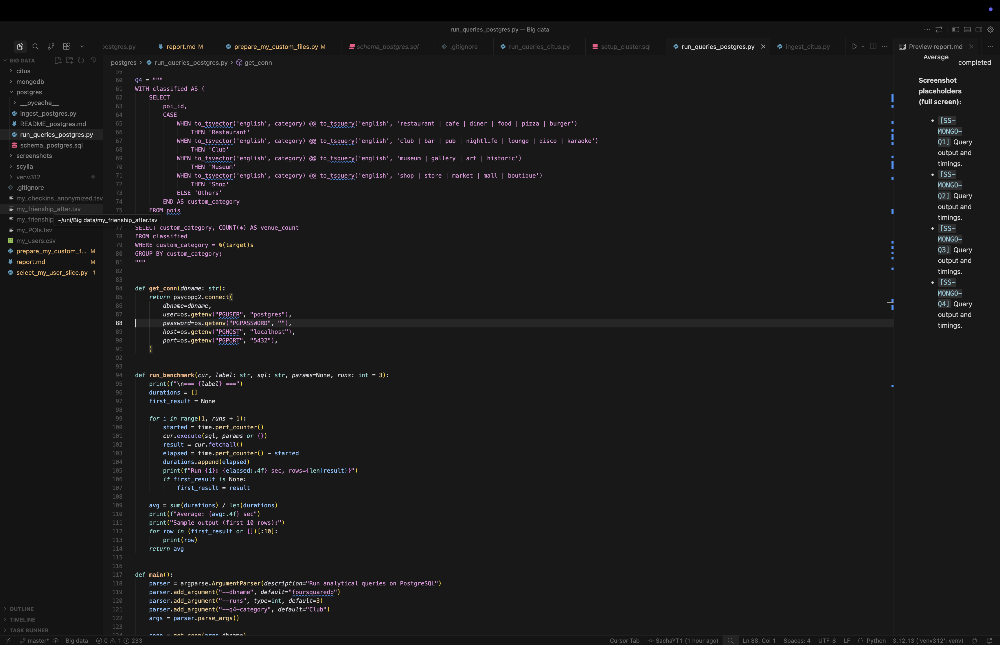
- `[SS-Q2-2]` Terminal timing output (3 runs + average).
  

---

### Q3. Attractive venues by shares and location

Justification (2-3 sentences):  
This query groups check-ins by venue and location attributes and counts all shares, including repeated check-ins by the same user at different timestamps. Sorting by descending count reveals the most attractive venues in the slice. The output includes country and coordinates to satisfy the location requirement.

Query text:

```sql
SELECT
    c.poi_id,
    p.category,
    p.country,
    p.latitude,
    p.longitude,
    COUNT(*) AS total_shares
FROM checkins c
JOIN pois p ON p.poi_id = c.poi_id
GROUP BY c.poi_id, p.category, p.country, p.latitude, p.longitude
ORDER BY total_shares DESC
LIMIT 20;
```

Result + timing:

| Run | Time (sec) |
|---:|---:|
| 1 | 8.7995 |
| 2 | 4.4852 |
| 3 | 4.5097 |
| Average | 5.9315 |

Sample result (first rows):
- `(4d8cce87cb9b224bb19c5d41, Other Great Outdoors, TR, 40.990475, 29.029119, 16501)`
- `(4b49cb0ff964a520b67326e3, Other Great Outdoors, TR, 40.964434, 29.073215, 15147)`

**Screenshot placeholders (full screen):**
- `[SS-Q3-1]` Query code and output rows.
  
- `[SS-Q3-2]` Terminal timing output (3 runs + average).
  

---

### Q4. Custom venue categories with full-text search

Justification (2-3 sentences):  
The `category` column in POIs contains fine-grained labels, so we map them into broader custom groups using PostgreSQL full-text search (`to_tsvector`, `to_tsquery`) and a `CASE` expression. This approach is robust to wording variations and aligns with the assignment requirement for text-search-based categorization. The final query counts venues for a selected custom category (example: `Club`).

Query text:

```sql
WITH classified AS (
    SELECT
        poi_id,
        CASE
            WHEN to_tsvector('english', category) @@ to_tsquery('english', 'restaurant | cafe | diner | food | pizza | burger')
                THEN 'Restaurant'
            WHEN to_tsvector('english', category) @@ to_tsquery('english', 'club | bar | pub | nightlife | lounge | disco | karaoke')
                THEN 'Club'
            WHEN to_tsvector('english', category) @@ to_tsquery('english', 'museum | gallery | art | historic')
                THEN 'Museum'
            WHEN to_tsvector('english', category) @@ to_tsquery('english', 'shop | store | market | mall | boutique')
                THEN 'Shop'
            ELSE 'Others'
        END AS custom_category
    FROM pois
)
SELECT custom_category, COUNT(*) AS venue_count
FROM classified
WHERE custom_category = 'Club'
GROUP BY custom_category;
```

Result + timing:

| Run | Time (sec) |
|---:|---:|
| 1 | 3.9757 |
| 2 | 3.9692 |
| 3 | 3.9655 |
| Average | 3.9701 |

Sample result:
- `('Club', 190074)`

**Screenshot placeholders (full screen):**
- `[SS-Q4-1]` Query code and output rows.
  
- `[SS-Q4-2]` Terminal timing output (3 runs + average).
  

---

## Summary Table (Part IV.A)

| Database | Q1 | Q2 | Q3 | Q4 | Database Setup | CPU cores allocated | Main Memory usage |
|---|---:|---:|---:|---:|---|---:|---:|
| PostgreSQL | 2.4992 | 12.1086 | 5.9315 | 3.9701 | A single server | `12` | `36 GiB` |
| Citus Data | 15.5531 | 34.3268 | 36.8578 | 24.0533 | A cluster of `3` nodes | `12` | `36 GiB` |
| ScyllaDB | 0.0040 | 0.0038 | 0.0018 | 0.0011 | A cluster of `3` nodes | `3 (1 per node)` | `6 GiB (2 GiB per node)` |
| MongoDB | `Not completed` | `Not completed` | `Not completed` | `Not completed` | A replica set of `3` nodes | `Not measured` | `Not measured` |

---

## Notes for Final PDF Export

- Keep all required screenshots **full screen** and uncropped.
- For each task, include:
  1. query text in the table/section,
  2. screenshot of query execution and output,
  3. measured timings.
- Ensure all required screenshots are added before converting to PDF.

---

## Source Used for Assignment Instructions

- Assignment page and report template link: [BS - Assignment 1 - Big Data Storage in SQL vs. NoSQL Databases](https://firas-jolha.github.io/bigdata/html/bs/BS%20-%20Assignment%201%20-%20Big%20Data%20Storage%20in%20SQL%20vs.%20NoSQL%20Databases.html#Report-template)

---

## Citus Section

### What is Citus (short explanation)

Citus is a distributed SQL extension for PostgreSQL. It keeps PostgreSQL syntax and tooling, but scales out data and query execution across multiple worker nodes through sharding. A coordinator node accepts SQL and plans distributed execution on workers.

---

## II.A PostgreSQL (Citus Data) Schema Design [Citus part]

### II.A.C1 Cluster and Database Setup

Setup files:
- `citus/docker-compose.yml` (3-node cluster: 1 coordinator + 2 workers)
- `citus/setup_cluster.sql` (registers worker nodes)
- `citus/schema_citus.sql` (schema + distribution commands + indexes)

Commands used:

```bash
cd "/Users/algavkovskii/uni/Big data/citus"
docker compose up -d
docker exec -i citus_coordinator psql -U postgres -d foursquaredb < setup_cluster.sql
```

Distribution strategy:
- `checkins` distributed by `userid`
- `friendship_before` distributed by `userid`
- `friendship_after` distributed by `userid`
- `users` distributed by `userid`
- `pois` as reference table

Shard-key justification (required by assignment):
I selected `userid` as the distribution column for the main activity table (`checkins`) because the workload includes user-centric operations and social analysis. Co-locating user-related tables by the same key helps reduce cross-node movement in these operations. `pois` is defined as a reference table to keep POI joins local on each worker for analytical aggregations.

How this differs from standalone PostgreSQL:
Standalone PostgreSQL stores all data on one node with local indexes only. Citus adds horizontal partitioning across workers and distributed planning/execution, so table distribution and shard-key choice become core schema design decisions.

**Screenshot placeholders (full screen):**
- `[SS-CITUS-IIA-1]` `docker compose up -d` output.
  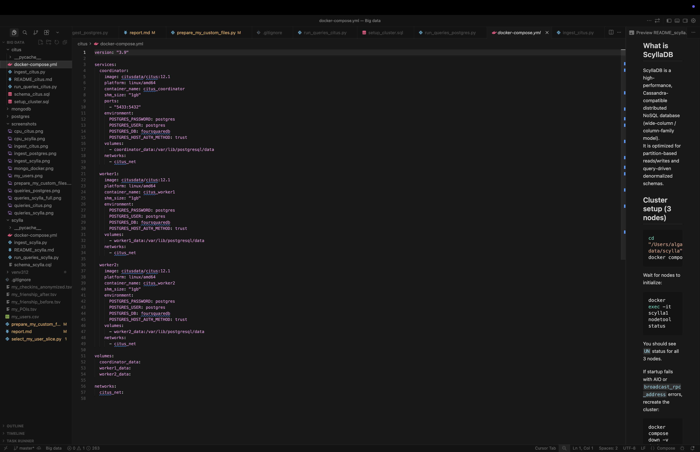
- `[SS-CITUS-IIA-2]` output of `setup_cluster.sql` with active workers.
  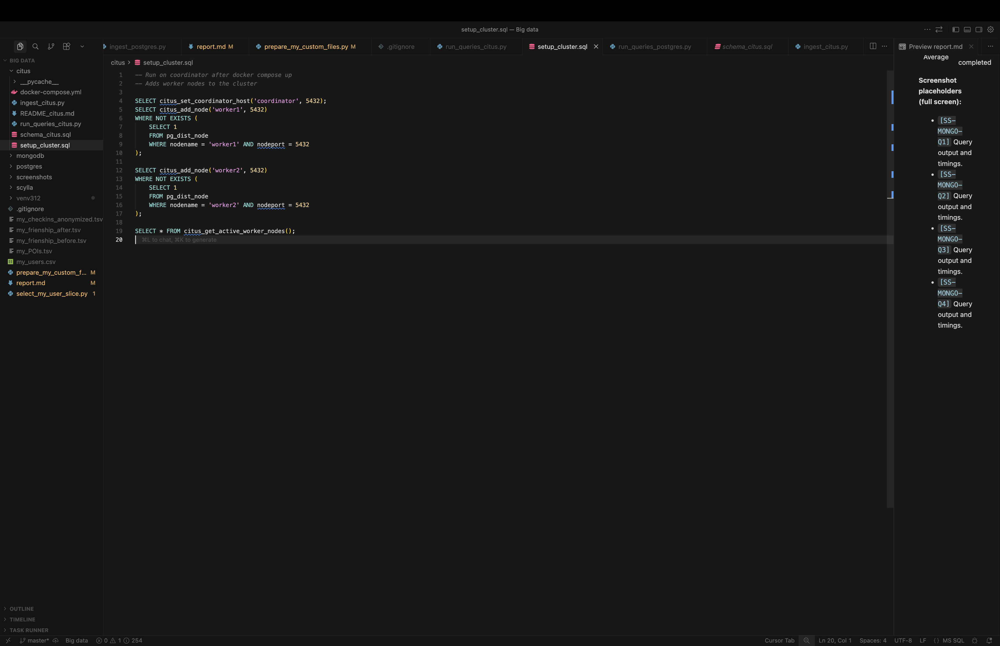
- `[SS-CITUS-IIA-3]` `schema_citus.sql` code and created objects.
  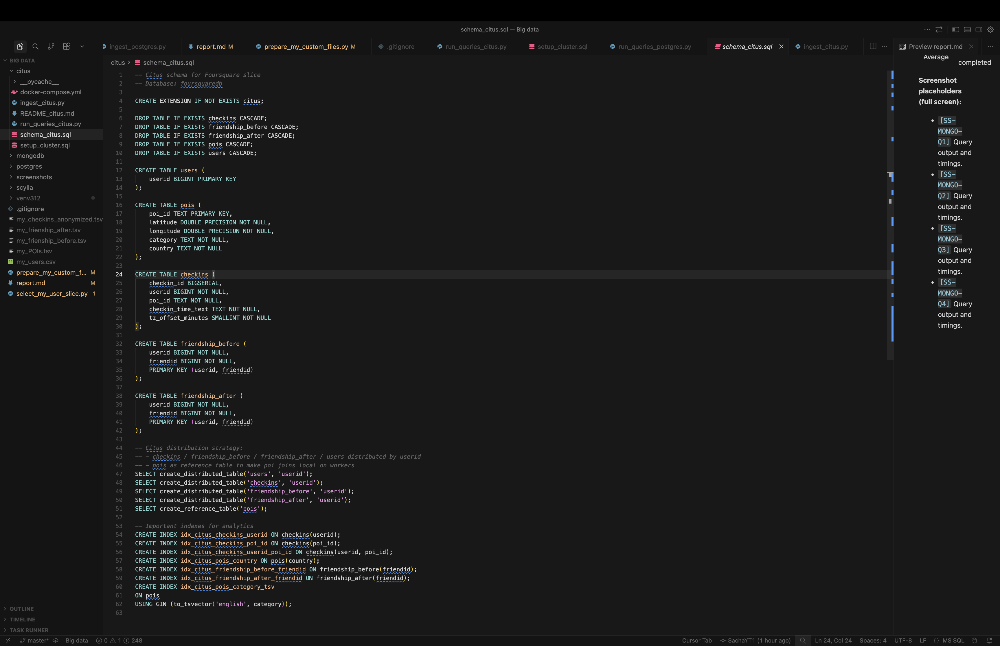

---

## II.B Data Ingestion [Citus row]

Ingestion script:
- `citus/ingest_citus.py`

Command used:

```bash
cd "/Users/algavkovskii/uni/Big data"
source venv/bin/activate
export PGHOST=localhost
export PGPORT=5433
export PGUSER=postgres
export PGPASSWORD=postgres
python citus/ingest_citus.py --dbname foursquaredb --skip-create-db
```

Observed Citus ingestion output:

| Table | Time (sec) |
|---|---:|
| `users` | 2.19 |
| `pois` | 38.64 |
| `checkins` | 143.71 |
| `friendship_before` | 2.11 |
| `friendship_after` | 1.93 |
| **TOTAL** | **188.58** |

**Screenshot placeholders (full screen):**
- `[SS-CITUS-IIB-1]` `ingest_citus.py` code.
  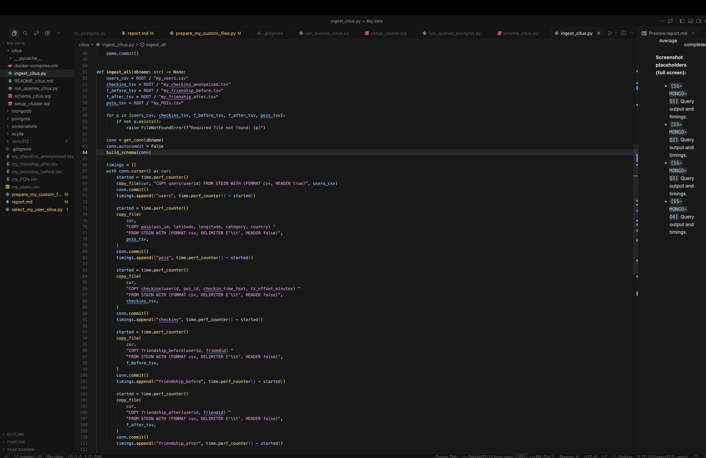
- `[SS-CITUS-IIB-2]` Terminal output with per-table and total ingestion time.
  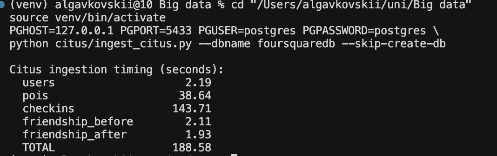

---

## III. Analytical Query Execution [Citus only]

Benchmark method:
- Script: `citus/run_queries_citus.py`
- Each query executed **3 times**
- Reported metric: **average execution time**

Command used:

```bash
python citus/run_queries_citus.py --dbname foursquaredb --runs 3 --q4-category Club
```

### Citus Q1 timing

| Run | Time (sec) |
|---:|---:|
| 1 | 18.5325 |
| 2 | 14.9469 |
| 3 | 13.1798 |
| Average | 15.5531 |

### Citus Q2 timing

| Run | Time (sec) |
|---:|---:|
| 1 | 36.2878 |
| 2 | 33.3210 |
| 3 | 33.3716 |
| Average | 34.3268 |

### Citus Q3 timing

| Run | Time (sec) |
|---:|---:|
| 1 | 39.1878 |
| 2 | 35.6881 |
| 3 | 35.6974 |
| Average | 36.8578 |

### Citus Q4 timing

| Run | Time (sec) |
|---:|---:|
| 1 | 24.5502 |
| 2 | 23.8758 |
| 3 | 23.7338 |
| Average | 24.0533 |

**Screenshot placeholders (full screen):**
- `[SS-CITUS-Q1]` Query output and timings.
  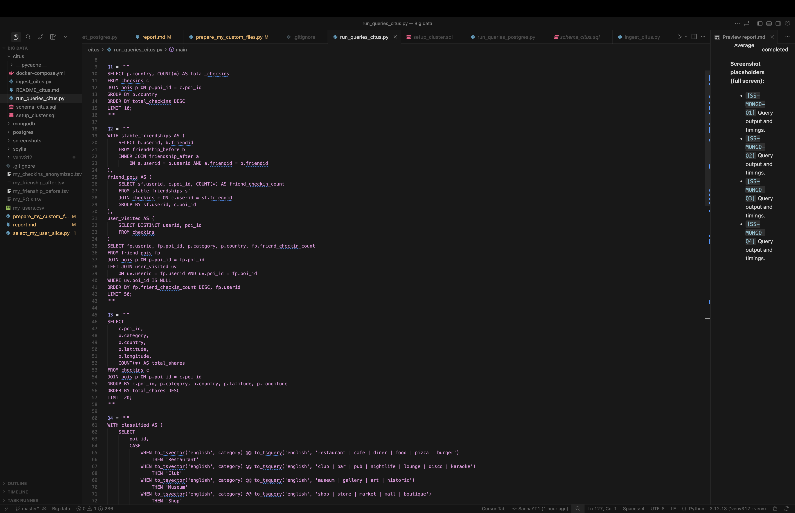
- `[SS-CITUS-Q2]` Query output and timings.
  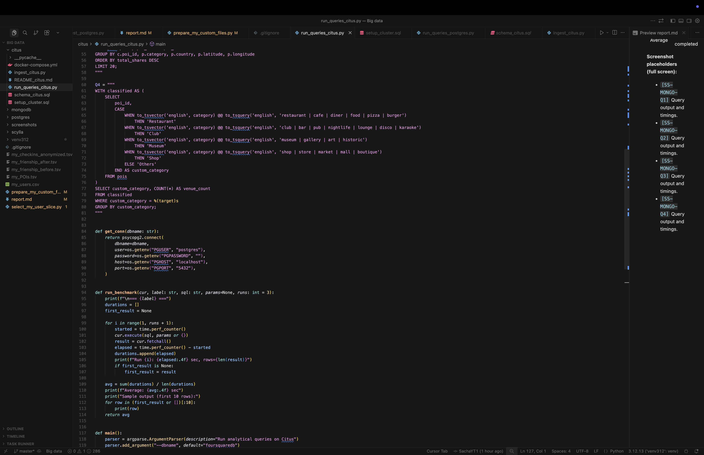
- `[SS-CITUS-Q3]` Query output and timings.
  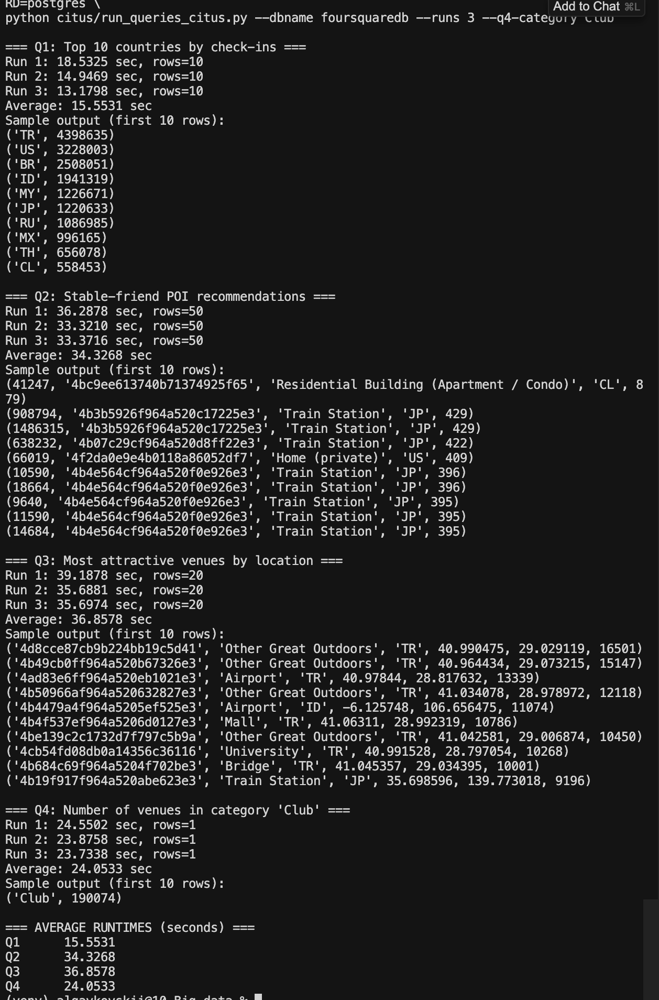
- `[SS-CITUS-Q4]` Query output and timings.
  

---

## ScyllaDB Section

### What is ScyllaDB (short explanation)

ScyllaDB is a Cassandra-compatible distributed wide-column database optimized for partition-based reads and writes. Instead of join-heavy SQL, Scylla typically uses denormalized, query-specific tables designed from access patterns.

---

## II.A ScyllaDB Data Model and Schema [Scylla part]

### II.A.S1 Cluster and Database Setup

Setup files:
- `scylla/docker-compose.yml` (3-node cluster)
- `scylla/schema_scylla.cql` (keyspace + tables)
- `scylla/README_scylla.md` (run instructions)

Commands used:

```bash
cd "/Users/algavkovskii/uni/Big data/scylla"
docker compose up -d
docker exec -it scylla1 nodetool status
```

Design rationale:
- Core ingestion tables: users, POIs, checkins-by-user/checkins-by-poi, friendships before/after.
- Query-serving tables for assignment analytics:
  - `q1_top_countries`
  - `q2_recommendations_global`
  - `q3_attractive_venues_global`
  - `q4_custom_category_counts`
- This follows Scylla/Cassandra best practice: query-first denormalization instead of runtime joins.

Logical model (Chebotko-style, text form):
- **User activity access pattern:** user -> check-ins over time -> implemented by `checkins_by_user` with partition key `(userid)` and clustering `(checkin_time, poi_id)`.
- **Venue activity access pattern:** POI -> check-ins over time -> implemented by `checkins_by_poi` with partition key `(poi_id)` and clustering `(checkin_time, userid)`.
- **Social graph snapshots:** user -> friends (before/after/stable) -> implemented by `friendship_before_by_user`, `friendship_after_by_user`, `stable_friendship_by_user` with partition key `(userid)` and clustering `(friendid)`.
- **Dimension lookup:** `pois_by_id` keeps venue metadata and precomputed `custom_category`.
- **Pre-aggregated analytics tables:** global ranking tables for Q1/Q2/Q3 and category-count table for Q4, to avoid unsupported multi-table joins and expensive cross-partition scans at query time.

Physical model notes:
- Keyspace: `foursquaredb` with `SimpleStrategy` and replication factor `3`.
- Write pattern is append-heavy to check-in tables plus periodic write of pre-aggregated result tables.
- Read path for assignment queries is single-partition (`bucket = 1` or `custom_category = ?`) with clustering-order retrieval for top-k.

**Screenshot placeholders (full screen):**
- `[SS-SCYLLA-IIA-1]` Docker cluster status (`nodetool status`).
  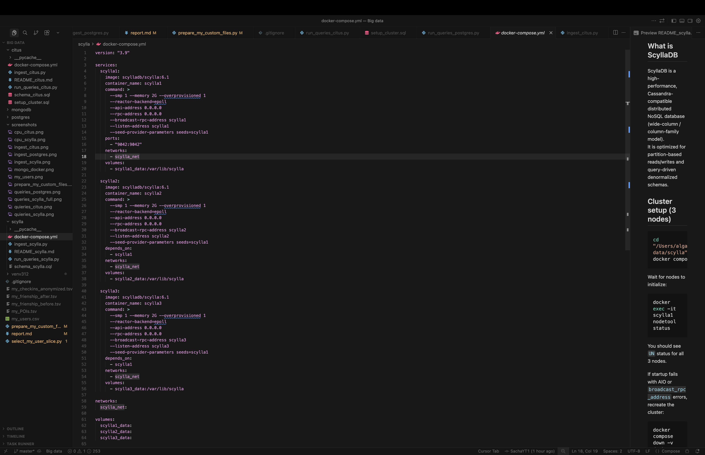
- `[SS-SCYLLA-IIA-2]` `schema_scylla.cql` code.
  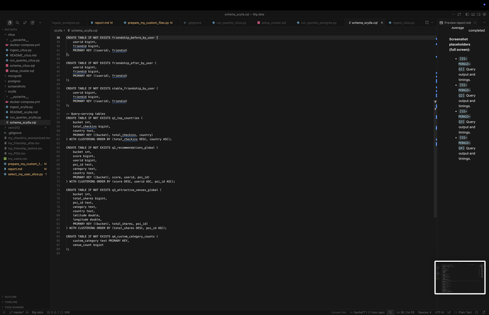
- `[SS-SCYLLA-IIA-3]` Keyspace/tables shown in `cqlsh`.
  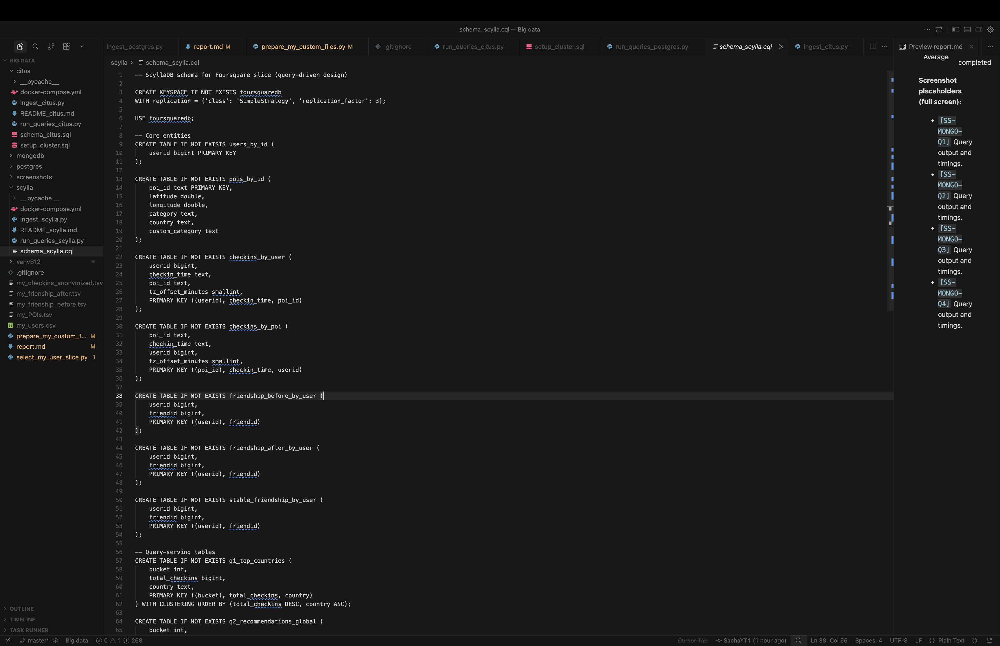

---

## II.B Data Ingestion [Scylla row]

Ingestion script:
- `scylla/ingest_scylla.py`

Command used:

```bash
cd "/Users/algavkovskii/uni/Big data"
source venv/bin/activate
python scylla/ingest_scylla.py --hosts 127.0.0.1 --port 9042
```

Observed Scylla ingestion output:

| Stage | Time (sec) |
|---|---:|
| `users` | 28.49 |
| `friendships` | 3.36 |
| `pois` | 328.30 |
| `checkins` | 2546.10 |
| `q1_table` | 0.01 |
| `q2_table` | 7.43 |
| `q3_table` | 396.65 |
| `q4_table` | 0.00 |
| **TOTAL** | **3310.36** |

**Screenshot placeholders (full screen):**
- `[SS-SCYLLA-IIB-1]` `ingest_scylla.py` code.
  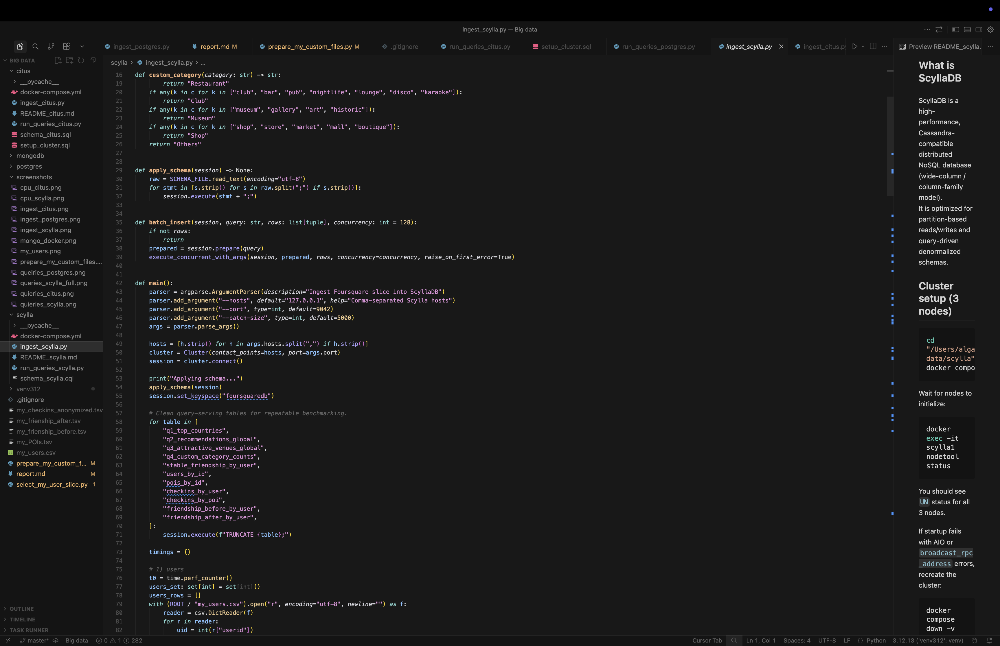
- `[SS-SCYLLA-IIB-2]` Terminal output with stage and total ingestion timing.
  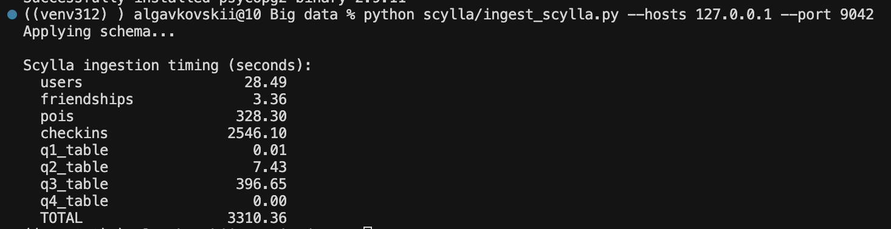

---

## III. Analytical Query Execution [Scylla only]

Benchmark method:
- Script: `scylla/run_queries_scylla.py`
- Each query executed **3 times**
- Reported metric: **average execution time**

Command used:

```bash
python scylla/run_queries_scylla.py --hosts 127.0.0.1 --port 9042 --runs 3 --q4-category Club
```

### Scylla Q1 timing

| Run | Time (sec) |
|---:|---:|
| 1 | 0.0063 |
| 2 | 0.0032 |
| 3 | 0.0025 |
| Average | 0.0040 |

### Scylla Q2 timing

| Run | Time (sec) |
|---:|---:|
| 1 | 0.0053 |
| 2 | 0.0034 |
| 3 | 0.0027 |
| Average | 0.0038 |

### Scylla Q3 timing

| Run | Time (sec) |
|---:|---:|
| 1 | 0.0023 |
| 2 | 0.0016 |
| 3 | 0.0014 |
| Average | 0.0018 |

### Scylla Q4 timing

| Run | Time (sec) |
|---:|---:|
| 1 | 0.0013 |
| 2 | 0.0012 |
| 3 | 0.0010 |
| Average | 0.0011 |

**Screenshot placeholders (full screen):**
- `[SS-SCYLLA-Q1]` Query output and timings.
  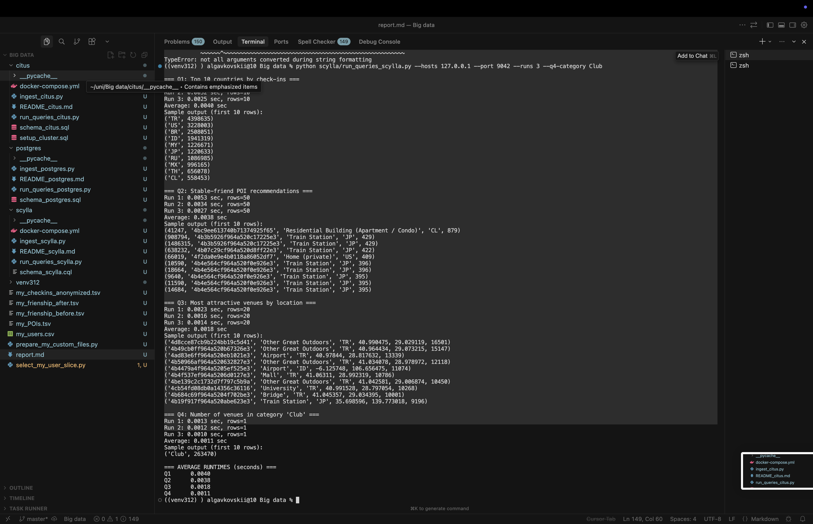
- `[SS-SCYLLA-Q2]` Query output and timings.
  
- `[SS-SCYLLA-Q3]` Query output and timings.
  
- `[SS-SCYLLA-Q4]` Query output and timings.
  

---

## MongoDB Section

### What is MongoDB (short explanation)

MongoDB is a document-oriented NoSQL database. For this assignment, I use a reference-based document model (separate collections for users, POIs, check-ins, and friendships) to avoid heavy duplication and to keep POI metadata centralized.

---

## II.A MongoDB Data Model and Schema [MongoDB part]

### II.A.M1 Replica Set and Object Design

Setup files:
- `mongodb/docker-compose.yml` (3-node replica set)
- `mongodb/init_replicaset.js` (replica set init)
- `mongodb/ingest_mongodb.py` (collection creation and loading)
- `mongodb/run_queries_mongodb.py` (query benchmark)

Commands used:

```bash
cd "/Users/algavkovskii/uni/Big data/mongodb"
docker compose up -d
docker exec -i mongo1 mongosh --quiet < init_replicaset.js
```

Document structure decision (embed vs reference):
- I selected **reference-based** modeling.
- `checkins` stores `userid` and `poi_id` references, while `pois` stores venue metadata.
- This reduces storage duplication because the same POI appears in many check-ins.
- It also keeps POI updates centralized and supports analytics with aggregation pipelines plus indexes.

Collections:
- `users` (`_id = userid`)
- `pois` (`_id = poi_id`, latitude, longitude, category, country)
- `checkins` (userid, poi_id, checkin_time, tz_offset_minutes)
- `friendship_before`, `friendship_after`, `stable_friendships` (userid, friendid)

Indexes:
- `checkins`: `userid`, `poi_id`, `(userid, poi_id)`
- `pois`: `_id`, `country`, text index on `category`
- friendships: `(userid, friendid)` and `friendid`

**Screenshot placeholders (full screen):**
- `[SS-MONGO-IIA-1]` replica set initialization and status.
  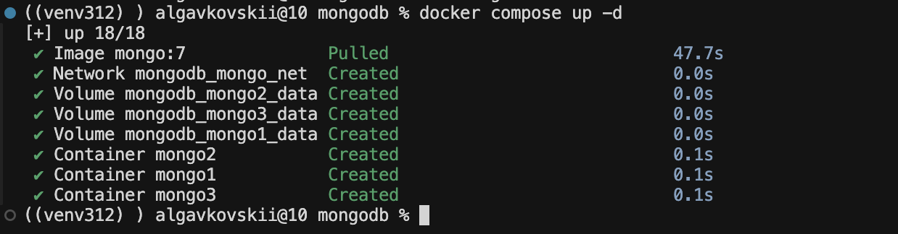
- `[SS-MONGO-IIA-2]` collection examples (document structure).
  
- `[SS-MONGO-IIA-3]` created indexes in MongoDB.
  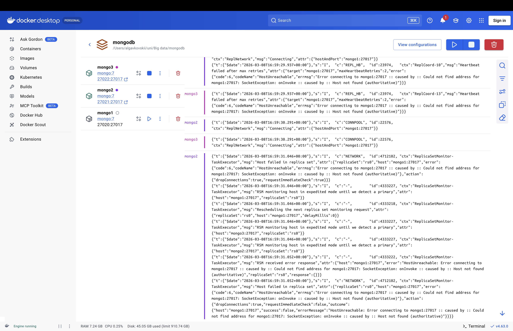

---

## II.B Data Ingestion [MongoDB row]

Ingestion script:
- `mongodb/ingest_mongodb.py`

Command used:

```bash
cd "/Users/algavkovskii/uni/Big data"
source venv312/bin/activate
python mongodb/ingest_mongodb.py --host localhost --ports "27020,27021,27022" --db foursquaredb
```

Observed MongoDB ingestion output:

| Stage | Time (sec) |
|---|---:|
| `users` | Not completed |
| `pois` | Not completed |
| `checkins` | Not completed |
| `friendships` | Not completed |
| `stable_friendships` | Not completed |
| `indexes` | Not completed |
| **TOTAL** | **Not completed** |

MongoDB execution note:
The MongoDB part could not be completed within the assignment time due to repeated instability in the Docker replica set (nodes periodically changed state and writes were interrupted with `NotWritablePrimary` / replica state change errors during ingestion). As a result, final ingestion and benchmark timings for MongoDB are not available.

**Screenshot placeholders (full screen):**
- `[SS-MONGO-IIB-1]` `ingest_mongodb.py` code.
  
- `[SS-MONGO-IIB-2]` Terminal output with stage and total ingestion timing.
  
- `[SS-MONGO-IIB-3]` Terminal screenshot showing replica-set instability / write interruption error.
  

---

## III. Analytical Query Execution [MongoDB only]

Benchmark method:
- Script: `mongodb/run_queries_mongodb.py`
- Each query executed **3 times**
- Reported metric: **average execution time**

Command used:

```bash
python mongodb/run_queries_mongodb.py --host localhost --ports "27020,27021,27022" --db foursquaredb --runs 3 --q4-category Club
```

### MongoDB Q1 timing

| Run | Time (sec) |
|---:|---:|
| 1 | Not completed |
| 2 | Not completed |
| 3 | Not completed |
| Average | Not completed |

### MongoDB Q2 timing

| Run | Time (sec) |
|---:|---:|
| 1 | Not completed |
| 2 | Not completed |
| 3 | Not completed |
| Average | Not completed |

### MongoDB Q3 timing

| Run | Time (sec) |
|---:|---:|
| 1 | Not completed |
| 2 | Not completed |
| 3 | Not completed |
| Average | Not completed |

### MongoDB Q4 timing

| Run | Time (sec) |
|---:|---:|
| 1 | Not completed |
| 2 | Not completed |
| 3 | Not completed |
| Average | Not completed |

**Screenshot placeholders (full screen):**
- `[SS-MONGO-Q1]` Query output and timings.
  
- `[SS-MONGO-Q2]` Query output and timings.
  
- `[SS-MONGO-Q3]` Query output and timings.
  
- `[SS-MONGO-Q4]` Query output and timings.
  
